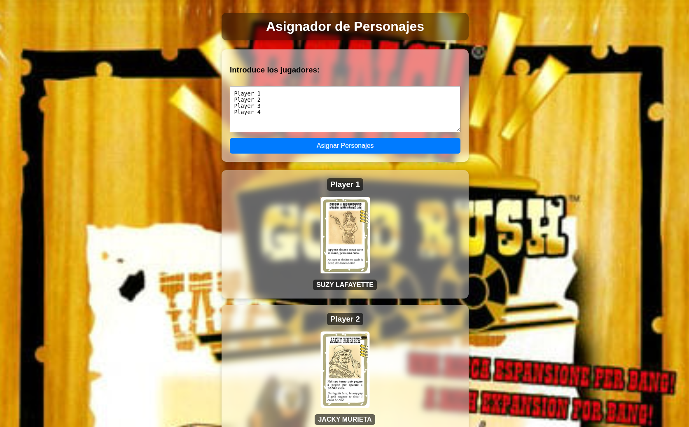

# Character Assigner

Welcome to the **Character Assigner**!  
This web app allows you to enter the names of players and randomly assign each one a character, displaying their card in a simple and elegant way.

---

## 🤠 Preview



---

## 📌 How to Use

To use the app, use this link:  
[https://juliangarr.github.io/BANG-Gold-Rush-Character-Asignation/](https://juliangarr.github.io/BANG-Gold-Rush-Character-Asignation/)  

Or scan this QR code:  


1. Enter the names of the players, one per line.  
2. Click **"Assign Characters"**.  
3. Each player will receive a random character and their card will be displayed.

---

## 📂 Project Structure

- /images → contains the images of the characters and the QR code
- index.html → main page
- style.css → page styling
- script.js → character assignment logic
- README.md → this file

---

## 📝 Features

- Blurred and elegant background image  
- Player input box with frosted glass effect  
- Character cards with blurred background  
- Player and character names on semi-transparent backgrounds and in bold  
- Mobile and desktop friendly  

---

## 🛠️ Development Instructions

To modify the app, clone the repo:

```bash
git clone https://github.com/tuusuario/BANG-Gold-Rush-Character-Asignation.git